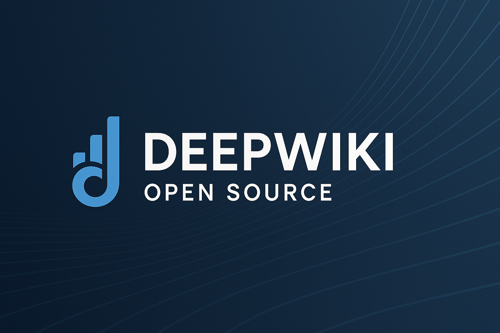
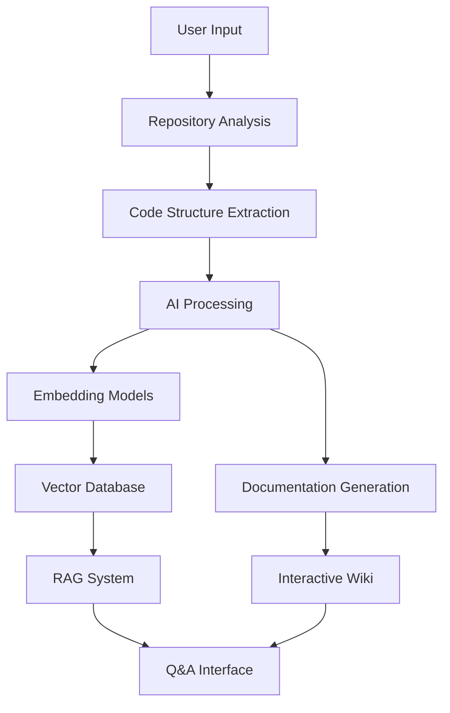

# CodeWiki AI



**CodeWiki AI** is an intelligent documentation platform that automatically generates comprehensive, interactive wikis for any GitHub, GitLab, or BitBucket repository. Transform your code into beautiful documentation with just a few clicks.

## ✨ Features

- **🚀 Instant Documentation**: Convert any repository into a professional wiki in seconds
- **🔐 Private Repository Support**: Securely access private repositories with personal access tokens
- **🤖 AI-Powered Analysis**: Smart understanding of code structure and relationships using multiple AI providers
- **📊 Beautiful Diagrams**: Automatic Mermaid diagrams to visualize architecture and data flow
- **🎯 Easy Navigation**: Intuitive interface to explore your documentation
- **💬 Interactive Q&A**: Chat with your repository using RAG-powered AI for accurate answers
- **🔍 Deep Research**: Multi-turn research process for thorough investigation of complex topics
- **🌐 Multiple AI Providers**: Support for Google Gemini, OpenAI, OpenRouter, and local Ollama models
- **🌍 Multi-language Support**: Generate documentation in multiple languages
- **📱 Responsive Design**: Works perfectly on desktop and mobile devices

## 🚀 Quick Start

### Option 1: Using Docker (Recommended)

```bash
# Clone the repository
git clone https://github.com/adarshp14/codewiki-ai.git
cd codewiki-ai

# Create environment file with your API keys
cp .env.example .env
# Edit .env with your API keys

# Run with Docker Compose
docker-compose up
```

### Option 2: Manual Setup

#### Prerequisites
- Node.js 18+ and npm/yarn
- Python 3.11+
- Git

#### Step 1: Clone and Install
```bash
git clone https://github.com/adarshp14/codewiki-ai.git
cd codewiki-ai

# Install JavaScript dependencies
npm install

# Install Python dependencies
pip install -r api/requirements.txt
```

#### Step 2: Environment Configuration
Create a `.env` file in the project root:

```env
# Required for Google Gemini models
GOOGLE_API_KEY=your_google_api_key

# Optional: OpenAI API key (not required if using Ollama for embeddings)
OPENAI_API_KEY=your_openai_api_key

# Optional: OpenRouter for accessing multiple models
OPENROUTER_API_KEY=your_openrouter_api_key

# Optional: Ollama host (default: http://localhost:11434)
OLLAMA_HOST=http://localhost:11434

# Optional: Server configuration
PORT=8001
SERVER_BASE_URL=http://localhost:8001
```

#### Step 3: Start the Services
```bash
# Terminal 1: Start the API server
python -m api.main

# Terminal 2: Start the frontend
npm run dev
```

#### Step 4: Access the Application
Open [http://localhost:3000](http://localhost:3000) in your browser.

## 🎯 How to Use

1. **Enter Repository URL**: Input any GitHub, GitLab, or Bitbucket repository URL
2. **Configure Settings**: Choose your AI provider, language, and documentation type
3. **Add Access Tokens** (if needed): For private repositories, add your personal access token
4. **Generate Wiki**: Click "Generate Wiki" and watch the magic happen!
5. **Explore & Ask**: Navigate through the generated documentation or ask questions about the code

## 🔧 Configuration

### AI Providers

**Google Gemini** (Default)
- Models: `gemini-2.0-flash`, `gemini-1.5-flash`, `gemini-1.0-pro`
- Get API key: [Google AI Studio](https://makersuite.google.com/app/apikey)

**OpenAI**
- Models: `gpt-4o`, `gpt-4o-mini`, and more
- Get API key: [OpenAI Platform](https://platform.openai.com/api-keys)

**OpenRouter**
- Access to multiple models via unified API
- Models: Claude, Llama, Mistral, and more
- Get API key: [OpenRouter](https://openrouter.ai/)

**Ollama (Local)**
- Run AI models locally for privacy
- Install: [Ollama](https://ollama.ai/)
- Default embedding model: `nomic-embed-text`

### Environment Variables

| Variable | Description | Required | Default |
|----------|-------------|----------|---------|
| `GOOGLE_API_KEY` | Google Gemini API key | For Gemini models | - |
| `OPENAI_API_KEY` | OpenAI API key | For OpenAI models | - |
| `OPENROUTER_API_KEY` | OpenRouter API key | For OpenRouter models | - |
| `OLLAMA_HOST` | Ollama server URL | For local Ollama | `http://localhost:11434` |
| `PORT` | API server port | No | `8001` |
| `SERVER_BASE_URL` | API server base URL | No | `http://localhost:8001` |

## 🏗️ Architecture



CodeWiki AI uses a modern architecture combining:
- **Frontend**: Next.js with React and TypeScript
- **Backend**: FastAPI with Python
- **AI Integration**: Multiple provider support (Google, OpenAI, OpenRouter, Ollama)
- **Vector Database**: FAISS for semantic search
- **Diagrams**: Mermaid for visual representations

## 🤝 Contributing

We welcome contributions! Please see our [Contributing Guidelines](CONTRIBUTING.md) for details.

1. Fork the repository
2. Create your feature branch (`git checkout -b feature/amazing-feature`)
3. Commit your changes (`git commit -m 'Add amazing feature'`)
4. Push to the branch (`git push origin feature/amazing-feature`)
5. Open a Pull Request

## 📄 License

This project is licensed under the MIT License - see the [LICENSE](LICENSE) file for details.

## 🙏 Acknowledgments

- Built by Adarsh Pandey with modern AI and web technologies
- Powered by various AI providers and open-source libraries
- Thanks to the community for feedback and contributions

## 📞 Support

- 🐛 **Bug Reports**: [GitHub Issues](https://github.com/adarshp14/codewiki-ai/issues)
- 💡 **Feature Requests**: [GitHub Discussions](https://github.com/adarshp14/codewiki-ai/discussions)
- 📧 **Email**: [Your Email]
- 🌐 **Website**: [Your Website]

---

⭐ **Star this repository if you find it helpful!**

Made with ❤️ by [Adarsh Pandey](https://github.com/adarshp14)